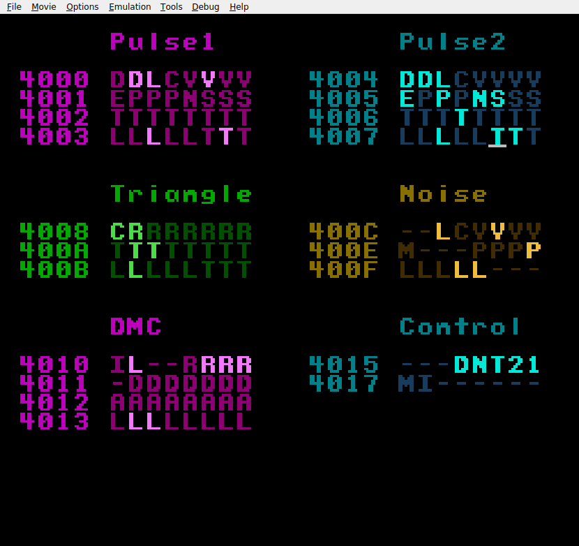

# NES Audio Playground

A tool for generating NES ROM files give access to the Audio Processing Unit's
registers. Move the cursor with the d-pad, press A to flip a bit, and hold B to
defer any bit flips until after B is released. Releasing B also has the side
effect of rewriting the current value of the register under the cursor.



[Video of the tool in use.](https://youtu.be/QHoISiWdPXo)

Inspired by
[livenes](http://ploguechipsounds.blogspot.com/2014/09/plogue-livenes.html).

Read about what each register does [here](https://www.nesdev.org/wiki/APU).

This tool is written in Rust using the
[mos6502_assembler](https://crates.io/crates/mos6502_assembler) DSL.

## Usage

Generate a ROM with the command:
```
cargo run -- -o output.nes
```

Then run it in a NES emulator (e.g. fceux):
```
fceux output.nes
```

In addition to the pulse, triangle, and noise "instruments", the NES APU also
allows playback of 1-bit delta-modulated audio samples through its DMC (Delta
Modulated Channel). Samples are stored in ROM, and you can pack up to 3 samples
into the generated ROM file by passing them on the command line. Only wav files
are accepted. Each sample should have at most 4096 (err...) samples per channel.
Corresponding sets of samples on different channels are averaged out to produce
mono audio. Pass no more than 3 samples. To choose the sample set the top two
bits of the 0x4012 register to 00, 01, or 10.
The low 4 bits of 0x4010 choose the sample rate of sample playback according to
[this table](https://www.nesdev.org/wiki/APU_DMC#Pitch_table).

```
cargo run -- sample0.wav sample1.wav sample2.wav -o output.nes
```

In most cases you'll probably want to downsample your samples so more time can
be represented by the 4096 allowed samples, and to sync up with the sample rates
used by the DMC. A handy command for resampling a wav file to a given sample
rate (8000Hz in this example) is:
```
ffmpeg -i original.wav -ar 8000 resampled.wav
```
